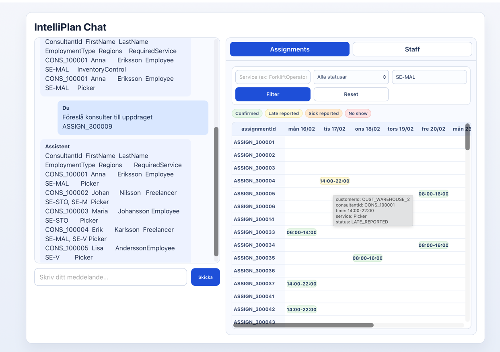

# IntelliPlan Chat

## Översikt



IntelliPlan Chat är en React-applikation för chatprompt-baserad planering och tilldelning av konsulter till tjänster/uppdrag.

Applikationen skickar användarens meddelande till backend-endpointen `POST /api/chat` och presenterar svaret i ett chatgränssnitt.

## Syfte

- Ställa frågor om planering, bemanning och uppdrag.
- Hämta information om konsulter, kunder, assignment och tillhörande begränsningar.
- Få textbaserade beslutsunderlag direkt i chatten.

## API

Frontend anropar:

```bash
curl -s -X POST http://localhost:8080/api/chat \
  -H "Content-Type: application/json" \
  -d '{"message":"Föreslå konsulter till uppdraget ASSIGN_300009"}'
```

Begäran:

```json
{
  "message": "din fråga"
}
```

Svar:

- Stöd för både `application/json` och `text/plain`.
- Chatten renderar radbrytningar och enkel markdown (`**fet text**`).

## Kom igång

1. Installera beroenden:
   `npm install`
2. Starta frontend:
   `npm start`
3. Öppna:
   `http://localhost:3000`
4. Säkerställ att backend körs på:
   `http://localhost:8080`

## Domänbeskrivning

| Domän | Services | Typ |
| --- | --- | --- |
| Consultant Domain | Consultant, ConsultantNote, Availability | Core Support |
| Assignment Domain | Assignment | Core Domain |
| Customer Domain | Customer | Supporting |
| Skill/Service Domain | Service | Supporting |
| Organization Domain | Region, Pool | Supporting |

## Stödda frågor just nu

Endast frågor som inte är utkommenterade i backend-exemplen är stödda.

### Assignment

- `Föreslå konsulter till uppdraget ASSIGN_300009`
- `Vilka uppdrag är i status NO_SHOW?`
- `Hur många uppdrag är i NO_SHOW?`
- `Vilka uppdrag finns i följande datum 2026-02-23?`
- `Hur många uppdrag finns i följande datum 2026-02-23?`
- `Vilka konsulter är på uppdrag datum 2026-02-23?`
- `Jobbar Lovisa Wallin den 2026-02-23?`

### Consultant

- `Lista alla konsulter.`
- `Visa uppgifter om konsult CONS_100001?`
- `Visa uppgifter om konsult CONS_100002?`
- `Visa uppgifter om konsult Karin Håkansson?`
- `Visa konsultprofil för Karin Lundqvist, CONS_100086.`
- `Vilka konsulter är tillgängliga den 2026-02-20?`
- `Vilka konsulter är tillgängliga den 2026-02-23?`
- `Lista konsulter som är sjuka den 2026-02-25.`

### Service/Skill

- `Vilka kompetenser har konsult CONS_100086?`
- `Vilka kompetenser har konsult Karin Håkansson?`
- `Vilka kompetenser har konsult Karin Lundqvist?`
- `Vilka konsulter har kompetensen Picker och TeamLead?`
- `Vilka konsulter har kompetensen ForkliftOperator?`
- `Lista alla kompetenser.`

### Customer

- `Lista alla kunder.`
- `Visa information om kund CUST_WAREHOUSE_10.`
- `Visa alla kunder med riskprofil MEDIUM.`
- `Visa alla kunder i region malmö.`

### Organization

- `Vilka regioner finns?`
- `Vilken region tillhör konsult Karin Lundqvist, CONS_100086?`
- `Vilken region tillhör konsult Johan Björk?`
- `Vilka konsulter är i region Linköping.`
- `Hur många konsulter finns i region Linköping?`
- `Hur många konsulter finns i region Stockholm?`
- `Lista alla regioner och antal konsulter per region.`
- `Vilken region har flest konsulter?`
